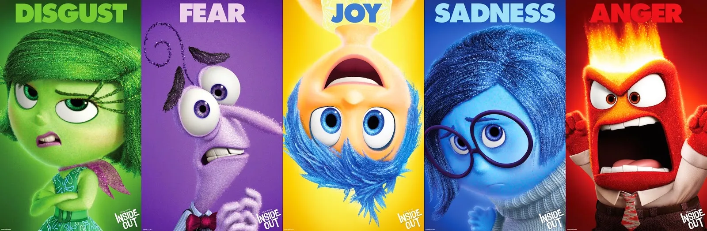
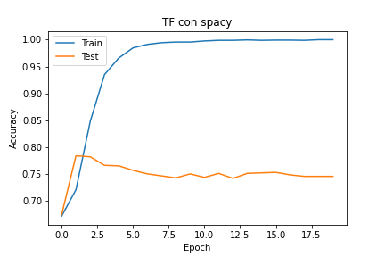
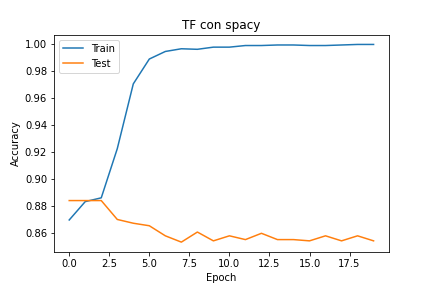
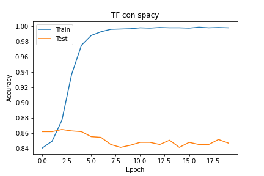
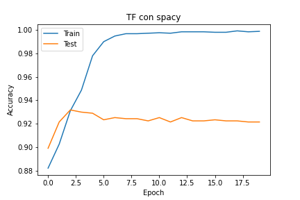
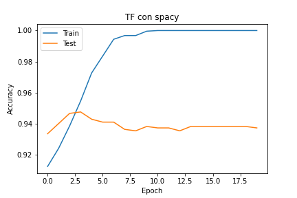
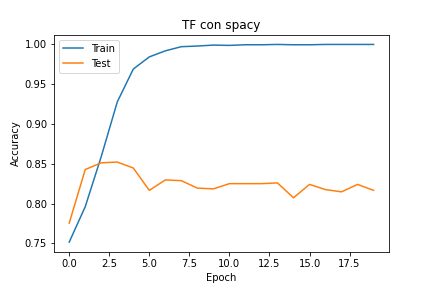
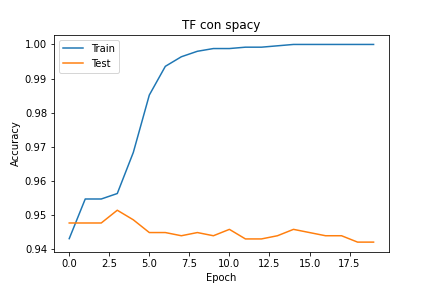
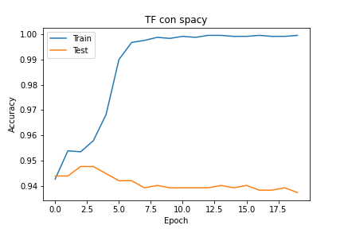

# NLP-Sentiment-Analysis



**Practica de Analisis de sentimiento**

**Master mIA3 - Universidad de Valencia**

**Nombre: Mauricio Arancibia**

## Requerimientos

- tensorflow
- sklearn
- transformer

## Descripcion del Problema

Se trata de un problema de clasificación multietiqueta en el que tenéis que etiquetar un conjunto de tweets de acuerdo a 11 sentimientos ('anger', 'anticipation', 'disgust', 'fear', 'joy', 'love', 'optimism', 'pessimism', 'sadness', 'surprise', 'trust').
Disponéis de un conjunto de 3561 tweets etiquetas para entrenar y validar el modelo o modelos necesarios, en el archivo 'sem_eval_train_es.csv'.

Cada alumno tiene que validar sus modelos sobre el conjunto ciego de test con el nombre 'sem_eval_test_blank_es.csv'. Cada Tweet tiene un ID (primera columna) que tenéis que mantener en vuestra solución. Debéis aplicar vuestro modelo entrenado a este conjunto y guardarlo en un archivo CSV de nombre 'soluciones_nombre_apellido1_apellido2.csv'. El archivo CSV a entregar debe tener esta estructura de Pandas:

```
class 'pandas.core.frame.DataFrame'>
RangeIndex: 679 entries, 0 to 678
Data columns (total 12 columns):
 #   Column        Non-Null Count  Dtype 
---  ------        --------------  ----- 
 0   ID            679 non-null    object
 1   anger         679 non-null    bool  
 2   anticipation  679 non-null    bool  
 3   disgust       679 non-null    bool  
 4   fear          679 non-null    bool  
 5   joy           679 non-null    bool  
 6   love          679 non-null    bool  
 7   optimism      679 non-null    bool  
 8   pessimism     679 non-null    bool  
 9   sadness       679 non-null    bool  
 10  surprise      679 non-null    bool  
 11  trust         679 non-null    bool  
dtypes: bool(11), object(1)

```

**Si el archivo no tiene exactamente esa estructura no se podrá evaluar.**

Entrega:

Cada alumno deberá entregar a través de esta tarea habilitada en AV el archivo CSV de las predicciones en el conjunto ciego de test y todo el código en Python utilizado tanto para el entrenamiento de los modelos como la inferencia en el conjunto ciego de test. El código Python se entregará como Notebook de Jupyter.

## Datos 

Se tiene un dataset para entrenamiento con 3561 tweets con diferentes tipos de sentimientos (odio,anticipacion, disgusto, miedo, alegría, amor, optimismo, pesimismo, tristeza, sorpresa y confianza). 

El dataset de tes tiene 679 tweets para sus respectiva prediccion.


# EDA

Al analizar este dataset se identificó que un tweet puede contener uno o varios sentimientos. La mayoria de los tweets se clasifican en dos sentimientos, por lo que no es factible construir un solo modelo para resolver este problema.

## Solución

El problema consiste en una clasificacion multiclase de sentimientos, pero debido a que cada tweet puede tener uno o mas sentimientos, de esta forma se procede a separar el dataset por cada sentimiento y luego entrenamos el modelo por cada sentimiento.

Finalmente se ensamblara las predicciones del dataset de TEst por cada sentimiento de acuerdo al formato establecido como salida.

## Prepocesado

Se procede con la limpieza de los textos eliminando signos de puntacion y la generacion de tokens para el modelo de clasificacion.

## Modelo

Se ha empleado una CNN con al siguiente arquitectura:

```
Model: "sequential_17"
_________________________________________________________________
 Layer (type)                Output Shape              Param #   
=================================================================
 embedding_17 (Embedding)    (None, 33, 50)            288500    
                                                                 
 dropout_23 (Dropout)        (None, 33, 50)            0         
                                                                 
 conv1d_17 (Conv1D)          (None, 31, 64)            9664      
                                                                 
 global_max_pooling1d_17 (Gl  (None, 64)               0         
 obalMaxPooling1D)                                               
                                                                 
 dense_22 (Dense)            (None, 1)                 65        
                                                                 
 activation_17 (Activation)  (None, 1)                 0         
                                                                 
=================================================================
Total params: 298,229
Trainable params: 298,229
Non-trainable params: 0
_________________________________________________________________
None

```

# Resultados

Para la mayoria de los sentimientos se obtuvieron un accuracy entre 75% y 85%, sin embargo por la cantidad de datos del dataset de entrenamiento, el modelo tiene a sobreajustarse.

Graficas de Tranining

- Enojo



- Anticipación



- Disgusto



- Miedo



- Alegría


- Amor



- Optimismo


- Pesimismo


- Tristeza



- Sorpresa



- Confianza


